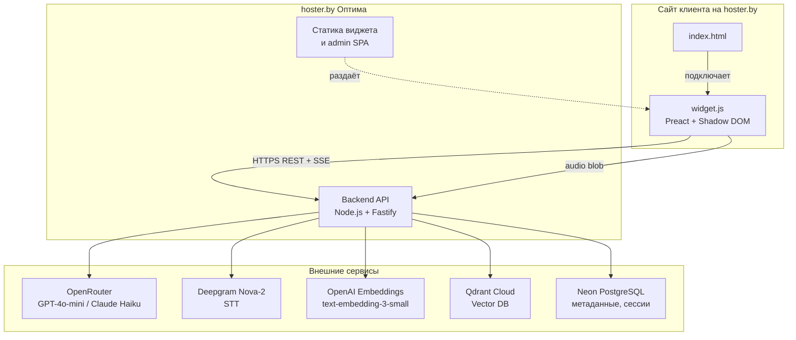
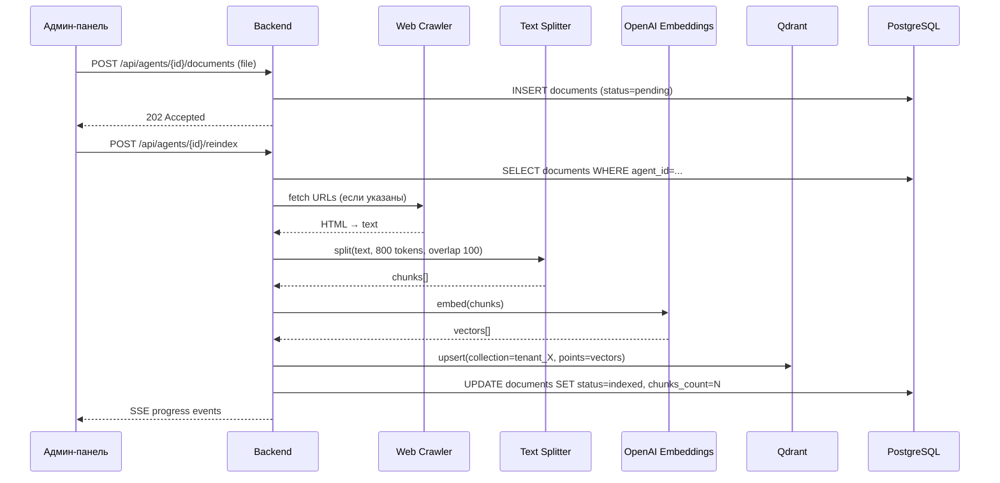
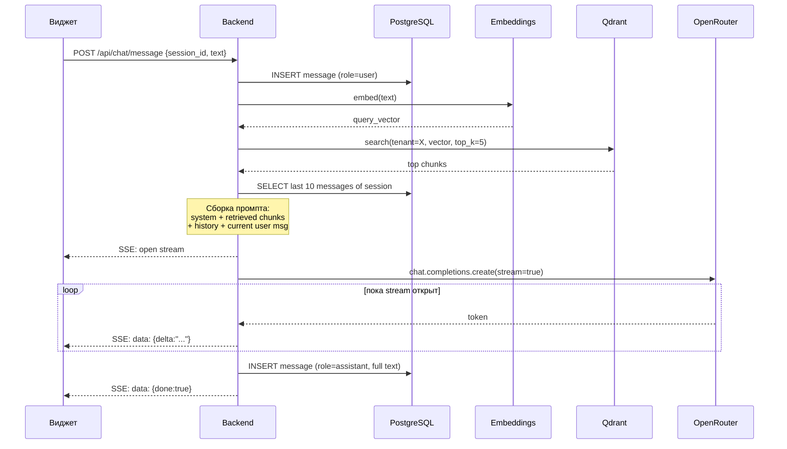
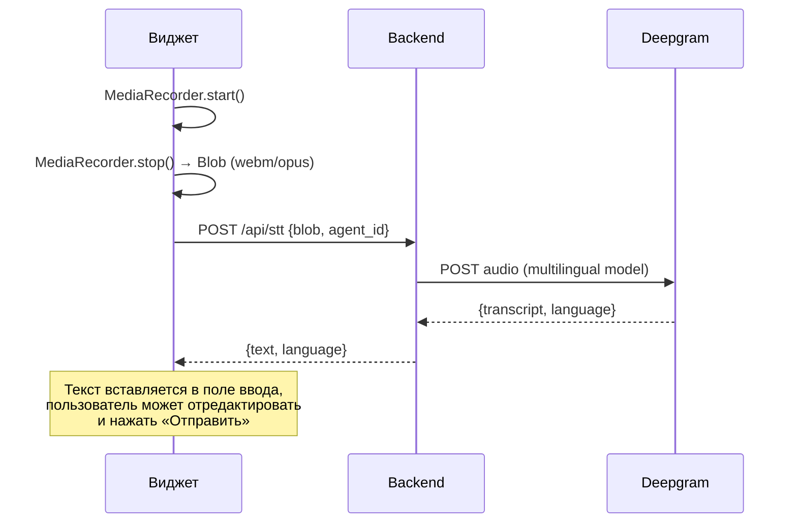

# Архитектура EchoSupport

## 1. Высокоуровневая схема



## 2. Логические компоненты

### 2.1 Frontend (3 артефакта)

| Артефакт    | Где живёт                          | Технология                          | Назначение                                                   |
| ----------- | ---------------------------------- | ----------------------------------- | ------------------------------------------------------------ |
| `widget.js` | Раздаётся бэкендом по `/widget.js` | Preact + Shadow DOM                 | Чат-виджет на сайте клиента                                  |
| Admin SPA   | Раздаётся по `/admin/*`            | React + Vite + Tailwind + shadcn/ui | Панель настройки агента                                      |
| `embed.js`  | Раздаётся по `/embed.js`           | Vanilla JS, ~1KB                    | Лоадер: создаёт `<script>` для widget.js и `<div>`-контейнер |

**Сниппет, который владелец сайта вставляет себе:**

```html
<script src="https://echosupport.example.by/embed.js" data-agent-id="ag_01HK..." defer></script>
```

### 2.2 Backend (Node.js + Fastify)

Модули:

- `app/server.ts` — точка входа Fastify.
- `modules/auth/` — JWT-авторизация админа.
- `modules/agents/` — CRUD агентов, settings.
- `modules/knowledge/` — загрузка файлов, краулинг URL, чанкинг, индексация.
- `modules/chat/` — сессии, retrieval, LLM streaming (SSE).
- `modules/stt/` — proxy на Deepgram.
- `modules/jobs/` — фоновые задачи (TTL cleanup, индексация).
- `adapters/llm/` — `OpenRouterAdapter` (реализует `ILLMAdapter`).
- `adapters/stt/` — `DeepgramAdapter` (реализует `ISTTAdapter`).
- `adapters/embeddings/` — `OpenAIEmbeddingsAdapter`.
- `adapters/vectorstore/` — `QdrantAdapter`.
- `adapters/storage/` — локальная FS или S3-совместимое (для файлов знаний).

### 2.3 Внешние сервисы

См. [`plans/02-tech-stack.md`](02-tech-stack.md) для обоснования выбора.

## 3. Поток данных: индексация знаний



## 4. Поток данных: пользовательский запрос (текст)



**Индикатор «печатает»**:

- Виджет показывает «{Имя агента} печатает…» сразу после отправки сообщения.
- Прячет индикатор после первого `delta`-события (или когда уже есть несколько слов).
- Если SSE долго не отвечает — индикатор продолжает мигать.

## 5. Поток данных: голосовой ввод



## 6. Multi-tenancy

- **Логически**: `Tenant → Agent(s) → Documents/Sessions/Messages`.
- **Для MVP**: один пользователь-админ владеет одним тенантом с одним агентом. Но схема и API поддерживают N агентов.
- **Изоляция в Qdrant**: одна коллекция на тенанта (например, `kb_tenant_{tenant_id}`). Альтернатива — общая коллекция с фильтром `payload.tenant_id`. Выбираем **коллекция-на-тенанта** — проще удалять, лучше изоляция.
- **Изоляция в PG**: все таблицы имеют `tenant_id`, индексы на `(tenant_id, ...)`.

## 7. Приоритет источников знаний

В настройках агента — поле `source_priority`:

- `merge` (по умолчанию) — все чанки в общем индексе, ранжируются по cosine similarity.
- `files_first` — сначала ищем в файлах, если top-1 score < threshold → ищем в URL-чанках.
- `url_first` — наоборот.

Технически это решается через payload-фильтр в Qdrant (`source_type: "file" | "url"`) и две последовательные search-запроса при `*_first` режимах.

## 8. Контекст диалога (Conversation Memory)

Стратегия **sliding window + summary**:

- Храним все сообщения сессии в PG.
- В промпт LLM кладём:
  - `system` (system_prompt агента + retrieved chunks).
  - **Последние 8 пар** user/assistant.
  - Если общий объём истории > 6000 токенов — старые сворачиваем в `summary` (отдельный LLM-вызов раз в N сообщений).
- `summary` хранится в `sessions.summary` и обновляется лениво.

## 9. Streaming через SSE

- Endpoint `POST /api/chat/stream` возвращает `Content-Type: text/event-stream`.
- События:
  - `event: open` — начало.
  - `event: typing` — индикатор (опционально, периодический heartbeat).
  - `event: delta` — `data: {"text": "..."}`.
  - `event: done` — `data: {"message_id": "...", "full_text": "..."}`.
  - `event: error` — `data: {"code": "...", "message": "..."}`.
- На стороне виджета — `EventSource` API.
- **Почему SSE, а не WebSocket**: проще проксируется через Passenger/Nginx hoster.by, не нужна двусторонняя связь, идеально для streaming-ответов.

## 10. Шифрование секретов

API-ключи внешних сервисов (OpenRouter, Deepgram, Qdrant, OpenAI) хранятся **в БД** в шифрованном виде:

- Алгоритм: AES-256-GCM.
- Master key: переменная окружения `MASTER_ENCRYPTION_KEY` (32 байта в base64).
- В `agents.encrypted_secrets` хранится JSON с зашифрованными значениями.
- Расшифровка только в памяти бэкенда непосредственно перед вызовом API.

**Альтернатива на старте**: один общий ключ в `.env` для всех тенантов (быстрее для MVP). Делаем второй вариант для Phase 0–4, шифрованное per-tenant хранилище — Phase 11.

## 11. Виджет и Shadow DOM

Виджет монтируется в Shadow DOM, чтобы:

- CSS сайта-клиента не сломал стили чата.
- Стили виджета не утекли на сайт.
- Микрофонные пермишны запрашиваются на origin сайта-клиента (стандартное поведение браузера).

CORS на бэкенде разрешает запросы только с доменов, занесённых в `agents.allowed_origins`.

## 12. Структура репозитория (монорепо, pnpm workspaces)

```
echosupport/
├── plans/                    # документация архитектуры (этот файл и др.)
├── docs/                     # пользовательская документация
│   ├── api.md
│   ├── widget-integration.md
│   └── deploy.md
├── apps/
│   ├── backend/              # Fastify API
│   ├── admin/                # React admin SPA
│   └── widget/               # Preact embed widget
├── packages/
│   ├── shared/               # общие TS-типы, zod-схемы
│   └── core/                 # доменная логика (RAG, чанкинг, промпты)
├── scripts/                  # скрипты (deploy, migrate, seed)
├── .env.example
├── .gitignore
├── package.json              # pnpm workspaces root
├── pnpm-workspace.yaml
├── tsconfig.base.json
└── README.md
```
