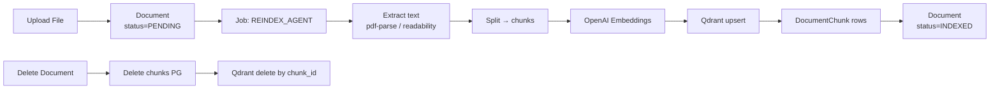

# Модель данных

## 1. PostgreSQL — реляционная схема (Prisma DSL)

```prisma
// prisma/schema.prisma

generator client { provider = "prisma-client-js" }
datasource db    { provider = "postgresql"; url = env("DATABASE_URL") }

// ─────────────────────────────────────────────────────────────
// Tenants & Users (multi-tenancy ready)
// ─────────────────────────────────────────────────────────────

model Tenant {
  id          String   @id @default(cuid())
  name        String
  createdAt   DateTime @default(now())
  users       User[]
  agents      Agent[]
}

model User {
  id           String   @id @default(cuid())
  tenantId     String
  email        String   @unique
  passwordHash String
  role         UserRole @default(OWNER)
  createdAt    DateTime @default(now())
  tenant       Tenant   @relation(fields: [tenantId], references: [id], onDelete: Cascade)
}

enum UserRole { OWNER ADMIN OPERATOR }

// ─────────────────────────────────────────────────────────────
// Agent — основная сущность: «AI-помощник для конкретного сайта»
// ─────────────────────────────────────────────────────────────

model Agent {
  id              String   @id @default(cuid())
  tenantId        String
  name            String                          // отображаемое имя ("Анна")
  role            String?                         // "Консультант EchoShop"
  avatarUrl       String?
  systemPrompt    String   @db.Text               // инструкции
  llmModel        String   @default("openai/gpt-4o-mini")
  embeddingModel  String   @default("text-embedding-3-small")
  language        String   @default("auto")       // "auto" | "ru" | "en" | ...
  sourcePriority  SourcePriority @default(MERGE)
  sessionTtlMinutes Int    @default(120)          // 2 часа
  publicKey       String   @unique                // ключ для виджета (data-agent-id)
  allowedOrigins  String[] @default([])           // CORS whitelist
  isActive        Boolean  @default(true)
  encryptedSecrets Json?                          // зашифрованные API-ключи
  createdAt       DateTime @default(now())
  updatedAt       DateTime @updatedAt

  tenant     Tenant     @relation(fields: [tenantId], references: [id], onDelete: Cascade)
  documents  Document[]
  sources    KnowledgeSource[]
  sessions   Session[]

  @@index([tenantId])
  @@index([publicKey])
}

enum SourcePriority { MERGE FILES_FIRST URL_FIRST }

// ─────────────────────────────────────────────────────────────
// Источники знаний
// ─────────────────────────────────────────────────────────────

// Файл, загруженный админом
model Document {
  id           String   @id @default(cuid())
  agentId      String
  filename     String
  mimeType     String
  sizeBytes    Int
  storagePath  String                            // путь в файловом хранилище
  status       IndexStatus @default(PENDING)
  chunksCount  Int      @default(0)
  errorMessage String?
  createdAt    DateTime @default(now())
  indexedAt    DateTime?

  agent  Agent  @relation(fields: [agentId], references: [id], onDelete: Cascade)
  chunks DocumentChunk[]

  @@index([agentId])
}

// URL, который краулится (источник из веба)
model KnowledgeSource {
  id           String   @id @default(cuid())
  agentId      String
  url          String
  maxDepth     Int      @default(1)              // 0 = только сама страница
  includePaths String[] @default([])             // glob patterns
  excludePaths String[] @default([])
  status       IndexStatus @default(PENDING)
  pagesIndexed Int      @default(0)
  errorMessage String?
  createdAt    DateTime @default(now())
  indexedAt    DateTime?

  agent  Agent  @relation(fields: [agentId], references: [id], onDelete: Cascade)
  chunks DocumentChunk[]

  @@index([agentId])
}

enum IndexStatus { PENDING INDEXING INDEXED FAILED }

// Метаданные чанка (сам вектор живёт в Qdrant; здесь — для удобства удаления и аудита)
model DocumentChunk {
  id           String   @id @default(cuid())
  agentId      String
  documentId   String?
  sourceId     String?
  qdrantPointId String  @unique                  // UUID, который мы передали в Qdrant
  chunkIndex   Int
  content      String   @db.Text
  tokensCount  Int
  sourceType   ChunkSourceType
  sourceLabel  String?                           // имя файла или URL
  createdAt    DateTime @default(now())

  document Document?        @relation(fields: [documentId], references: [id], onDelete: Cascade)
  source   KnowledgeSource? @relation(fields: [sourceId],   references: [id], onDelete: Cascade)

  @@index([agentId])
  @@index([documentId])
  @@index([sourceId])
}

enum ChunkSourceType { FILE URL }

// ─────────────────────────────────────────────────────────────
// Сессии и сообщения
// ─────────────────────────────────────────────────────────────

model Session {
  id            String   @id @default(cuid())
  agentId       String
  visitorId     String?                          // анонимный куки на стороне виджета
  origin        String?                          // domain сайта-клиента
  userAgent     String?
  ipHash        String?                          // hash (не сам IP) для rate-limit
  language      String?                          // авто-определённый язык
  summary       String?  @db.Text                // свёртка старых сообщений
  startedAt     DateTime @default(now())
  lastActiveAt  DateTime @default(now())
  expiresAt     DateTime                         // считается из agent.sessionTtlMinutes
  closedAt      DateTime?

  // ── Phase 10.5 (Operator Inbox + Handoff) ──
  status              SessionStatus @default(ACTIVE)
  assignedOperatorId  String?
  handoffRequestedAt  DateTime?
  handoffReason       String?
  visitorName         String?
  visitorContact      String?       // телефон или email — если посетитель сам оставил
  pageUrl             String?
  pageReferrer        String?
  unreadByOperator    Int           @default(0)
  unreadByVisitor     Int           @default(0)
  tags                String[]      @default([])
  internalNote        String?       @db.Text
  csatRating          Int?          // 1=👍, -1=👎 (или 1..5)
  csatComment         String?

  agent    Agent     @relation(fields: [agentId], references: [id], onDelete: Cascade)
  messages Message[]

  @@index([agentId])
  @@index([expiresAt])                           // для cleanup-job
  @@index([status, lastActiveAt])                // для inbox-фильтров
  @@index([assignedOperatorId])
}

enum SessionStatus { ACTIVE WAITING_OPERATOR WITH_OPERATOR RESOLVED CLOSED }

model Message {
  id         String   @id @default(cuid())
  sessionId  String
  role       MessageRole
  content    String   @db.Text
  tokensIn   Int?
  tokensOut  Int?
  retrievedChunkIds String[] @default([])        // для аудита, какие чанки использовались
  latencyMs  Int?
  createdAt  DateTime @default(now())

  // ── Phase 10.5 ──
  authorType MessageAuthorType @default(AGENT)   // VISITOR / AGENT / OPERATOR / SYSTEM
  authorId   String?                              // userId оператора, если authorType=OPERATOR
  isInternal Boolean            @default(false)   // приватная заметка, не видна посетителю
  attachments Json?                                // Phase 10.7: [{url, mimeType, sizeBytes, filename}]

  session Session @relation(fields: [sessionId], references: [id], onDelete: Cascade)

  @@index([sessionId])
}

enum MessageRole { USER ASSISTANT SYSTEM TOOL }
enum MessageAuthorType { VISITOR AGENT OPERATOR SYSTEM }

// ─────────────────────────────────────────────────────────────
// Фоновые задачи / индексация
// ─────────────────────────────────────────────────────────────

model Job {
  id         String   @id @default(cuid())
  type       JobType
  agentId    String?
  payload    Json
  status     JobStatus @default(PENDING)
  progress   Int      @default(0)                // 0..100
  errorMessage String?
  scheduledAt DateTime @default(now())
  startedAt  DateTime?
  finishedAt DateTime?

  @@index([status, scheduledAt])
}

enum JobType   { REINDEX_AGENT CRAWL_URL CLEANUP_SESSIONS SUMMARIZE_SESSION }
enum JobStatus { PENDING RUNNING DONE FAILED CANCELLED }
```

## 2. Qdrant — векторная коллекция

### Схема коллекции (одна на тенанта)

- **Имя коллекции**: `kb_tenant_{tenantId}`.
- **Размерность**: 1536 (для `text-embedding-3-small`).
- **Distance**: `Cosine`.
- **Optimizers**: `default_segment_number = 2`.

### Payload точки

```json
{
  "agent_id": "ag_01HK...",
  "tenant_id": "tn_01HK...",
  "document_id": "doc_01HK...",   // или null если из URL
  "source_id":  "src_01HK...",    // или null если из файла
  "chunk_id":   "chk_01HK...",    // = DocumentChunk.id в PG
  "source_type": "file" | "url",
  "source_label": "products.pdf" | "https://example.com/about",
  "chunk_index": 0,
  "content_preview": "первые 200 символов..."  // для отладки
}
```

### Индексы payload

Создаём индексы на `agent_id`, `source_type` для быстрого фильтра.

### Запрос на поиск

```ts
qdrant.search(`kb_tenant_${tenantId}`, {
  vector: queryEmbedding,
  filter: {
    must: [
      { key: 'agent_id', match: { value: agentId } },
      // при FILES_FIRST/URL_FIRST добавляется source_type
    ],
  },
  limit: 5,
  with_payload: true,
});
```

## 3. Файловое хранилище

Структура на диске (MVP):

```
/var/echosupport/uploads/
└── {tenantId}/
    └── {agentId}/
        ├── {documentId}.pdf
        ├── {documentId}.txt
        └── ...
```

Доступ только через бэкенд (никакой прямой раздачи через Nginx).

## 4. Sequence: жизненный цикл чанка



## 5. Очистка устаревших сессий (TTL)

Фоновая задача (раз в 15 мин):

```sql
DELETE FROM "Message" WHERE "sessionId" IN (
  SELECT id FROM "Session" WHERE "expiresAt" < NOW()
);
DELETE FROM "Session" WHERE "expiresAt" < NOW();
```

`expiresAt` обновляется на каждом сообщении: `expiresAt = NOW() + agent.sessionTtlMinutes`.

В админ-панели можно настроить:

- `sessionTtlMinutes` от 5 минут до бесконечности (0 = не удалять).
- Опцию «Удалять сразу при закрытии вкладки» (если виджет шлёт `beforeunload` с `closeSession`).

---

## 5.5. Дополнительные модели для Phase 10.5 – 10.7

> Эти модели вводятся вместе с миграциями Phase 10.5 (Operator Inbox + Handoff) и Phase 10.6 (Booking). Полное описание подхода — см. [`plans/09-phase-10.5-operator-inbox-and-booking.md`](09-phase-10.5-operator-inbox-and-booking.md).

```prisma
// ── Phase 10.5: Business Hours, Anti-abuse, Notifications, Canned ─

model BusinessHours {
  id                String   @id @default(cuid())
  agentId           String   @unique
  timezone          String   @default("Europe/Minsk")
  schedule          Json     // [{dayOfWeek:1, from:"09:00", to:"18:00"}, ...]
  holidays          Json?    // ["2026-01-01", ...]
  outOfHoursMessage String?  @db.Text
  enabled           Boolean  @default(false)

  agent Agent @relation(fields: [agentId], references: [id], onDelete: Cascade)
}

model VisitorRateLimit {
  id            String    @id @default(cuid())
  agentId       String
  visitorKey    String                       // visitorId или ipHash
  sessionsToday Int       @default(0)
  messagesHour  Int       @default(0)
  blockedUntil  DateTime?
  lastResetAt   DateTime  @default(now())

  @@unique([agentId, visitorKey])
  @@index([blockedUntil])
}

model OperatorNotification {
  id          String             @id @default(cuid())
  tenantId    String
  userId      String?                              // null = всем операторам тенанта
  type        NotificationType
  payload     Json                                 // {sessionId, snippet, appointmentId, ...}
  channels    String[]                             // ["browser","email","telegram"]
  status      NotificationStatus @default(PENDING)
  attempts    Int                @default(0)
  createdAt   DateTime           @default(now())
  deliveredAt DateTime?

  @@index([status, createdAt])
}

enum NotificationType   { HANDOFF_REQUESTED NEW_APPOINTMENT NEW_VISITOR_MESSAGE OPERATOR_MENTION }
enum NotificationStatus { PENDING DELIVERED FAILED }

model CannedResponse {
  id        String   @id @default(cuid())
  tenantId  String
  agentId   String?                                // null = доступен всем агентам тенанта
  shortcut  String                                 // "/привет"
  text      String   @db.Text
  language  String?
  createdAt DateTime @default(now())

  @@unique([tenantId, shortcut])
}

// Web Push подписки операторов (для уведомлений)
model PushSubscription {
  id        String   @id @default(cuid())
  userId    String
  endpoint  String   @unique
  p256dh    String
  auth      String
  userAgent String?
  createdAt DateTime @default(now())

  @@index([userId])
}

// ── Phase 10.6: Booking / Appointments ─

model Specialist {
  id          String   @id @default(cuid())
  tenantId    String
  agentId     String?                              // null = общий для всех агентов тенанта
  name        String
  role        String?                              // "Косметолог", "Стоматолог"
  description String?  @db.Text
  avatarUrl   String?
  isActive    Boolean  @default(true)
  createdAt   DateTime @default(now())
  updatedAt   DateTime @updatedAt

  services     Service[]
  workingHours SpecialistWorkingHours[]
  appointments Appointment[]

  @@index([tenantId])
  @@index([agentId])
}

model Service {
  id           String   @id @default(cuid())
  tenantId     String
  specialistId String?                            // null = может оказывать любой
  name         String                              // "Чистка лица"
  description  String?  @db.Text
  durationMin  Int                                 // 60
  priceLabel   String?                             // "от 80 руб"
  isActive     Boolean  @default(true)
  createdAt    DateTime @default(now())

  specialist   Specialist?  @relation(fields: [specialistId], references: [id], onDelete: SetNull)
  appointments Appointment[]

  @@index([tenantId])
  @@index([specialistId])
}

model SpecialistWorkingHours {
  id           String   @id @default(cuid())
  specialistId String
  dayOfWeek    Int                                 // 0..6, 0 = воскресенье
  fromMinutes  Int                                 // 540 = 09:00
  toMinutes    Int                                 // 1080 = 18:00

  specialist Specialist @relation(fields: [specialistId], references: [id], onDelete: Cascade)

  @@unique([specialistId, dayOfWeek, fromMinutes])
}

model Appointment {
  id              String            @id @default(cuid())
  tenantId        String
  agentId         String?
  sessionId       String?                          // откуда пришла запись (диалог)
  specialistId    String
  serviceId       String?
  visitorName     String                           // обязательное (минимум PII)
  visitorPhone    String                           // обязательное
  visitorEmail    String?
  startsAt        DateTime
  endsAt          DateTime
  status          AppointmentStatus @default(PENDING)
  source          AppointmentSource @default(AGENT)   // AGENT | OPERATOR
  notes           String?           @db.Text
  createdByUserId String?                          // если создал оператор вручную
  createdAt       DateTime          @default(now())
  updatedAt       DateTime          @updatedAt

  specialist Specialist @relation(fields: [specialistId], references: [id])
  service    Service?   @relation(fields: [serviceId], references: [id])

  @@index([specialistId, startsAt])
  @@index([tenantId, startsAt])
  @@index([status])
}

enum AppointmentStatus { PENDING CONFIRMED CANCELLED COMPLETED NO_SHOW }
enum AppointmentSource { AGENT OPERATOR }
```

### Влияние на существующие модели

- В `User` появляется значение роли `OPERATOR` (см. enum `UserRole`). Оператор имеет доступ только к Inbox и Appointments.
- В `Agent` добавляются поля настроек anti-abuse:
  ```prisma
  maxMessagesPerHourPerVisitor Int @default(60)
  maxSessionsPerDayPerVisitor  Int @default(10)
  maxMessageLength             Int @default(2000)
  bookingEnabled               Boolean @default(false)
  // список доступных специалистов/услуг агенту — через таблицы с null specialistId/agentId
  ```
- `Session` расширена статусами для inbox-флоу и полями для контактов посетителя/CSAT.
- `Message.authorType` отделяет автора (виджет/бот/оператор) от LLM-роли (`role`).

### Когда что заполнять

| Модель                   | Фаза появления данных |
| ------------------------ | --------------------- |
| `BusinessHours`          | Phase 10.5            |
| `VisitorRateLimit`       | Phase 10.5            |
| `OperatorNotification`   | Phase 10.5 / 10.6     |
| `CannedResponse`         | Phase 10.5            |
| `PushSubscription`       | Phase 10.5            |
| `Specialist` / `Service` | Phase 10.6            |
| `SpecialistWorkingHours` | Phase 10.6            |
| `Appointment`            | Phase 10.6            |

---

## 6. Дополнительные модели для SaaS-готовности

> Эти модели создаются **сразу при первой миграции** (Phase 1), но используются по мере прохождения roadmap. Полное обоснование — см. [`plans/08-commercialization.md`](08-commercialization.md).

```prisma
// ─────────────────────────────────────────────────────────────
// Тарифы и подписки (используется с Phase 11)
// ─────────────────────────────────────────────────────────────

model Plan {
  id                String   @id @default(cuid())
  name              String   @unique         // "Free", "Starter", "Pro", "Enterprise"
  priceMonthlyUsd   Decimal  @default(0)
  maxAgents         Int
  maxMessagesMonth  Int
  maxKnowledgeMB    Int
  allowsBYOK        Boolean  @default(false)
  allowsWhiteLabel  Boolean  @default(false)
  allowsWebhooks    Boolean  @default(false)
  isPublic          Boolean  @default(true)
  createdAt         DateTime @default(now())

  subscriptions     Subscription[]
}

model Subscription {
  id                     String             @id @default(cuid())
  tenantId               String             @unique
  planId                 String
  status                 SubscriptionStatus @default(TRIAL)
  trialEndsAt            DateTime?
  currentPeriodStart     DateTime           @default(now())
  currentPeriodEnd       DateTime
  externalProvider       String?            // "stripe" | "yookassa" | "bepaid"
  externalSubscriptionId String?
  cancelAtPeriodEnd      Boolean            @default(false)
  createdAt              DateTime           @default(now())
  updatedAt              DateTime           @updatedAt

  tenant Tenant @relation(fields: [tenantId], references: [id], onDelete: Cascade)
  plan   Plan   @relation(fields: [planId], references: [id])
}

enum SubscriptionStatus { TRIAL ACTIVE PAST_DUE CANCELLED }

// ─────────────────────────────────────────────────────────────
// Учёт использования (используется с Phase 3-4 для аналитики,
// с Phase 11 — для биллинга)
// ─────────────────────────────────────────────────────────────

model UsageRecord {
  id           String      @id @default(cuid())
  tenantId     String
  agentId      String?
  sessionId    String?
  serviceType  ServiceType
  provider     String                          // "openrouter" | "openai" | "deepgram" | ...
  model        String?
  tokensIn     Int?
  tokensOut    Int?
  audioSeconds Decimal?
  costUsd      Decimal     @default(0)
  meta         Json?
  createdAt    DateTime    @default(now())

  @@index([tenantId, createdAt])
  @@index([agentId, createdAt])
  @@index([sessionId])
}

enum ServiceType { LLM EMBEDDINGS STT TTS }

// ─────────────────────────────────────────────────────────────
// Аудит (используется с Phase 2)
// ─────────────────────────────────────────────────────────────

model AuditLog {
  id        String   @id @default(cuid())
  tenantId  String
  userId    String?
  action    String                           // "agent.created", "secrets.updated", ...
  entity    String?                          // "agent:ag_..." | "document:doc_..."
  meta      Json?
  ip        String?
  userAgent String?
  createdAt DateTime @default(now())

  @@index([tenantId, createdAt])
}

// ─────────────────────────────────────────────────────────────
// Brand / White-label (используется с Phase 12)
// ─────────────────────────────────────────────────────────────

model Brand {
  id            String   @id @default(cuid())
  tenantId      String   @unique
  brandName     String?
  logoUrl       String?
  primaryColor  String?                       // "#0066FF"
  accentColor   String?
  hideEchoBrand Boolean  @default(false)
  customCss     String?  @db.Text
  customDomain  String?  @unique              // CNAME для виджета
  createdAt     DateTime @default(now())
  updatedAt     DateTime @updatedAt

  tenant Tenant @relation(fields: [tenantId], references: [id], onDelete: Cascade)
}

// ─────────────────────────────────────────────────────────────
// Webhooks (используется с Phase 12)
// ─────────────────────────────────────────────────────────────

model WebhookEndpoint {
  id           String   @id @default(cuid())
  tenantId     String
  url          String
  secret       String                          // HMAC для подписи payload
  events       String[]                        // ["chat.message.created", ...]
  isActive     Boolean  @default(true)
  failureCount Int      @default(0)
  createdAt    DateTime @default(now())

  deliveries WebhookDelivery[]

  @@index([tenantId])
}

model WebhookDelivery {
  id             String        @id @default(cuid())
  endpointId     String
  event          String
  payload        Json
  status         WebhookStatus @default(PENDING)
  attempts       Int           @default(0)
  responseStatus Int?
  responseBody   String?
  scheduledAt    DateTime      @default(now())
  deliveredAt    DateTime?

  endpoint WebhookEndpoint @relation(fields: [endpointId], references: [id], onDelete: Cascade)

  @@index([status, scheduledAt])
}

enum WebhookStatus { PENDING DELIVERED FAILED }
```

В модели `Tenant` добавляются обратные relations:

```prisma
model Tenant {
  // ... существующие поля
  subscription Subscription?
  brand        Brand?
  webhooks     WebhookEndpoint[]
  // UsageRecord и AuditLog связаны по tenantId без явной relation для производительности
}
```

### Когда что заполнять

| Модель                         | С какой фазы данные начинают писаться                        |
| ------------------------------ | ------------------------------------------------------------ |
| `Plan`                         | seeded при init (free/starter/pro/enterprise), Phase 1       |
| `Subscription`                 | Phase 11 (регистрация SaaS-клиентов); до этого — нет записей |
| `UsageRecord`                  | Phase 3 (embeddings), Phase 4 (LLM), Phase 5 (STT)           |
| `AuditLog`                     | Phase 2 (admin actions)                                      |
| `Brand`                        | Phase 12 (white-label)                                       |
| `WebhookEndpoint` / `Delivery` | Phase 12                                                     |
