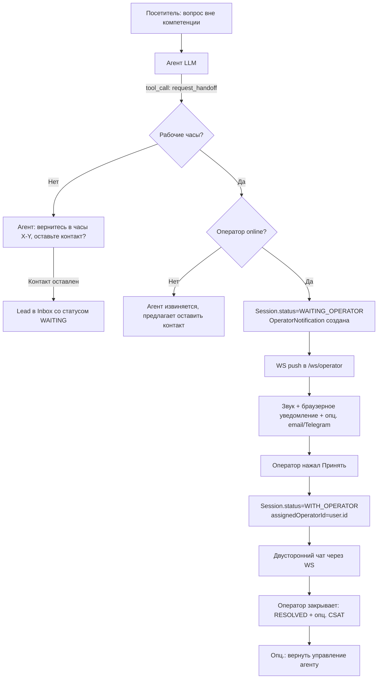

# Phase 10.5 – 10.7 — Operator Inbox, Human Handoff, Booking & UX-улучшения

> Документ описывает доработки, которые встраиваются **между Phase 10 (Deploy MVP) и Phase 11 (SaaS Foundation)**. Цель — превратить Stage 1 MVP в по-настоящему рабочий инструмент клиентской поддержки, прежде чем уходить в коммерциализацию.

---

## 0. Контекст и принципы

После Phase 10 у нас есть:

- Агент отвечает в виджете через RAG + LLM streaming, помнит контекст сессии, диалоги авто-удаляются по TTL.
- Админ создаёт агента, грузит знания, видит список сессий (read-only).

Чего не хватает:

1. Администратор/оператор не может **читать активные диалоги в реальном времени** и **подключаться** к разговору.
2. Агент не умеет **эскалировать** диалог человеку, когда вопрос вне его компетенции.
3. Нет понятия **рабочего времени** — агент мог бы предлагать связь с человеком в 3 часа ночи.
4. Нет **anti-abuse** для одного посетителя (бесконечные обращения, спам).
5. Нет **записи на приём** — критично для медицинских/косметических услуг.
6. Не реализованы стандартные «фишки» индустрии: CSAT, suggested replies, canned responses, прокативные сообщения.

### Принципы доработки

- **Минимум собираемых PII**: только `name` + `phone` для записи; всё остальное — опционально.
- **Роли**: ввести `OPERATOR` — может только читать/писать в активные диалоги, не имеет доступа к настройкам агента и базе знаний.
- **Realtime**: WebSocket для двусторонней связи операторов и виджета.
- **Backwards-compatible**: существующая модель `Session` / `Message` расширяется, но не ломается.
- **Function-calling first**: новые возможности агента (booking, handoff) реализуются как **tool-calls** LLM, чтобы их можно было включать/выключать на агенте.

---

## 1. Анализ best practices в индустрии

### Что есть у конкурентов (Intercom, Crisp, Tidio, LiveChat, HubSpot Chat, Tawk.to, Drift, Chatwoot)

| Категория                     | Возможность                                                            | Есть у нас? | Приоритет внедрения      |
| ----------------------------- | ---------------------------------------------------------------------- | ----------- | ------------------------ |
| **Human handoff**             | Эскалация бот→оператор, отметка «оператор подключился»                 | ❌          | **P0** (Phase 10.5)      |
| **Live inbox**                | Список активных диалогов, фильтры, статусы (open/pending/resolved)     | ❌          | **P0** (Phase 10.5)      |
| **Operator typing**           | Индикатор «оператор печатает» в виджете                                | ❌          | **P0** (Phase 10.5)      |
| **Visitor context**           | Страница, на которой посетитель, referrer, язык, гео (по IP)           | ⚠️ частично | P1 (Phase 10.5)          |
| **Business hours**            | Расписание работы; вне часов — другое поведение                        | ❌          | **P0** (Phase 10.5)      |
| **Anti-abuse / flood**        | Лимит сообщений/сессий с одного `visitorId`/IP                         | ⚠️ частично | **P0** (Phase 10.5)      |
| **CSAT (👍/👎)**              | Оценка ответа агента или диалога                                       | ❌          | P1 (Phase 10.7)          |
| **Canned responses**          | Шаблоны ответов оператора (быстрые фразы)                              | ❌          | P1 (Phase 10.5)          |
| **Suggested reply for human** | LLM предлагает черновик ответа оператору, тот редактирует и отправляет | ❌          | P1 (Phase 10.5)          |
| **Quick reply buttons**       | Агент предлагает варианты ответа кнопками                              | ❌          | P2 (Phase 10.7)          |
| **Proactive messages**        | Через N секунд на странице — приветствие/триггер                       | ❌          | P2 (Phase 10.7)          |
| **File attachments**          | Посетитель/оператор могут прикреплять файлы                            | ❌          | P2 (Phase 10.7)          |
| **Conversation transcript**   | Отправить транскрипт диалога на email посетителю                       | ❌          | P2 (Phase 10.7)          |
| **Tags / notes**              | Внутренние теги и заметки оператора по диалогу                         | ❌          | P1 (Phase 10.5)          |
| **Booking / appointments**    | Запись на приём через бот                                              | ❌          | **P0** (Phase 10.6)      |
| **Knowledge base public**     | Публичная FAQ-страница, на которую агент может ссылаться               | ❌          | P3 (позже)               |
| **Analytics dashboard**       | Топ-вопросы, нерешённые, время ответа                                  | ❌          | Phase 11 (уже в roadmap) |
| **Mobile operator app**       | Мобильное приложение/PWA для оператора                                 | ❌          | P3 (позже)               |
| **Read receipts**             | «Прочитано» в виджете                                                  | ❌          | P3                       |

### Что выделяет лучшие продукты

1. **Crisp / Intercom**: единый «Inbox» — все диалоги в одном месте с фильтрами и тегами.
2. **Drift**: «Conversational landing» — прокативные сценарии, ведущие к встрече/демо.
3. **Tidio Lyro / Intercom Fin**: AI-агент с явной точкой эскалации и контролем оператора.
4. **Chatwoot (open-source)**: SLA, response-time трекинг, командные «assignments».

---

## 2. Архитектурные решения

### 2.1 Роли

Расширяем `UserRole`:

```prisma
enum UserRole { OWNER ADMIN OPERATOR }
```

- **OWNER / ADMIN** — полный доступ.
- **OPERATOR** — доступ только к страницам `/inbox`, `/inbox/:sessionId`, `/appointments` (на чтение и подтверждение), может менять свой статус (online/away/offline). НЕ видит Agent settings, Knowledge, Secrets, Billing.

В UI админки роуты защищаются по роли. В backend — middleware `requireRole(['OWNER','ADMIN'])`.

### 2.2 Realtime: WebSocket

Добавляем `@fastify/websocket`. Два канала:

- **`/ws/operator`** (требует JWT, роль OWNER/ADMIN/OPERATOR) — подписка на события активных диалогов агентов своего тенанта.
- **`/ws/visitor`** (требует `sessionId` + agent publicKey) — двусторонний канал: посетитель получает сообщения оператора в реальном времени.

Существующий SSE для стриминга LLM-ответов **остаётся** — он удобен для unidirectional streaming. WS используем только для bidirectional нужд (operator→visitor, typing, presence, takeover-события).

Альтернатива (запасная): остаться на SSE + polling для админских апдейтов. Но WS проще и надёжнее для inbox.

### 2.3 Модель данных — расширения

```prisma
// Расширяем Session
model Session {
  // ... существующие поля
  status              SessionStatus @default(ACTIVE)   // ACTIVE / WAITING_OPERATOR / WITH_OPERATOR / RESOLVED / CLOSED
  assignedOperatorId  String?
  handoffRequestedAt  DateTime?
  handoffReason       String?
  visitorName         String?      // если посетитель сам назвался
  visitorContact      String?      // телефон или email — если оставил
  pageUrl             String?      // страница, с которой пишет
  pageReferrer        String?
  unreadByOperator    Int          @default(0)
  unreadByVisitor     Int          @default(0)
  tags                String[]     @default([])
  internalNote        String?      @db.Text   // приватная заметка оператора
  csatRating          Int?         // 1..5 или 1=👍 / -1=👎
  csatComment         String?
}

enum SessionStatus { ACTIVE WAITING_OPERATOR WITH_OPERATOR RESOLVED CLOSED }

// Расширяем Message
model Message {
  // ... существующие поля
  authorType  MessageAuthorType  @default(AGENT)  // VISITOR / AGENT / OPERATOR / SYSTEM
  authorId    String?                              // userId оператора, если authorType=OPERATOR
  isInternal  Boolean             @default(false)  // внутренняя заметка, не видна посетителю
}

enum MessageAuthorType { VISITOR AGENT OPERATOR SYSTEM }
// (MessageRole оставляем для LLM-формата, но добавляем authorType для UI/handoff)

// Рабочее время агента
model BusinessHours {
  id          String   @id @default(cuid())
  agentId     String   @unique
  timezone    String   @default("Europe/Minsk")
  schedule    Json                              // [{dayOfWeek:1, from:"09:00", to:"18:00"}, ...]
  holidays    Json?                             // ["2026-01-01", ...]
  outOfHoursMessage String? @db.Text            // что говорить вне часов
  enabled     Boolean  @default(false)

  agent Agent @relation(fields: [agentId], references: [id], onDelete: Cascade)
}

// Anti-abuse — учёт ограничений по visitorId/IP
model VisitorRateLimit {
  id              String   @id @default(cuid())
  agentId         String
  visitorKey      String                       // visitorId или ipHash
  sessionsToday   Int      @default(0)
  messagesHour    Int      @default(0)
  blockedUntil    DateTime?
  lastResetAt     DateTime @default(now())

  @@unique([agentId, visitorKey])
  @@index([blockedUntil])
}

// Уведомления операторов — outbox
model OperatorNotification {
  id           String   @id @default(cuid())
  tenantId     String
  userId       String?                          // конкретный оператор; null = всем
  type         NotificationType
  payload      Json                             // {sessionId, snippet, ...}
  channels     String[]                         // ["browser","email","telegram"]
  status       NotificationStatus @default(PENDING)
  createdAt    DateTime @default(now())
  deliveredAt  DateTime?
}

enum NotificationType { HANDOFF_REQUESTED NEW_APPOINTMENT NEW_VISITOR_MESSAGE OPERATOR_MENTION }
enum NotificationStatus { PENDING DELIVERED FAILED }

// Канные ответы (шаблоны для оператора)
model CannedResponse {
  id       String   @id @default(cuid())
  tenantId String
  agentId  String?                              // null = доступен всем агентам тенанта
  shortcut String                               // "/привет"
  text     String   @db.Text
  language String?
  createdAt DateTime @default(now())

  @@unique([tenantId, shortcut])
}

// ── Booking (Phase 10.6) ────────────────────────────────────

model Specialist {
  id          String   @id @default(cuid())
  tenantId    String
  agentId     String?                            // если null — общий
  name        String
  role        String?                            // "Косметолог", "Стоматолог"
  description String?  @db.Text
  avatarUrl   String?
  isActive    Boolean  @default(true)

  services    Service[]
  workingHours SpecialistWorkingHours[]
  appointments Appointment[]
}

model Service {
  id              String   @id @default(cuid())
  tenantId        String
  specialistId    String?                        // если null — может оказывать любой
  name            String                         // "Чистка лица"
  description     String?  @db.Text
  durationMin     Int                            // 60
  priceLabel      String?                        // "от 80 руб" — строкой, чтобы не возиться с валютами на MVP
  isActive        Boolean  @default(true)

  specialist Specialist? @relation(fields:[specialistId], references:[id], onDelete: SetNull)
  appointments Appointment[]
}

model SpecialistWorkingHours {
  id            String   @id @default(cuid())
  specialistId  String
  dayOfWeek     Int                              // 0..6, 0=воскресенье
  fromMinutes   Int                              // 540 = 09:00
  toMinutes     Int                              // 1080 = 18:00

  specialist Specialist @relation(fields:[specialistId], references:[id], onDelete: Cascade)
  @@unique([specialistId, dayOfWeek, fromMinutes])
}

model Appointment {
  id              String   @id @default(cuid())
  tenantId        String
  agentId         String?
  sessionId       String?                        // откуда пришла запись (диалог)
  specialistId    String
  serviceId       String?
  visitorName     String                         // обязательное
  visitorPhone    String                         // обязательное
  visitorEmail    String?
  startsAt        DateTime
  endsAt          DateTime
  status          AppointmentStatus @default(PENDING)
  source          AppointmentSource @default(AGENT)  // AGENT | OPERATOR
  notes           String?  @db.Text
  createdByUserId String?                        // если создал оператор
  createdAt       DateTime @default(now())
  updatedAt       DateTime @updatedAt

  specialist Specialist @relation(fields:[specialistId], references:[id])
  service    Service?   @relation(fields:[serviceId], references:[id])

  @@index([specialistId, startsAt])
  @@index([tenantId, startsAt])
}

enum AppointmentStatus { PENDING CONFIRMED CANCELLED COMPLETED NO_SHOW }
enum AppointmentSource { AGENT OPERATOR }
```

### 2.4 Поток Human Handoff



Tool-calls агента (через function-calling LLM):

- `request_handoff(reason: string)` — поднять флаг эскалации.
- `get_business_hours()` — проверить, рабочее ли сейчас время.
- `collect_contact(name: string, phone: string)` — записать контакт в Session (только если посетитель сам согласился).
- `list_specialists()` — получить список специалистов.
- `list_services(specialist_id?)` — получить услуги.
- `find_available_slots(specialist_id, service_id?, date_from, date_to)` — получить свободные слоты.
- `create_appointment_request(specialist_id, service_id?, starts_at, name, phone)` — создать `Appointment` со статусом `PENDING`.

> Все tool-calls **проверяются на серверной стороне** (нельзя дать LLM ходить мимо валидации). Tool-схемы декларируются в backend, передаются в `chatStream`.

### 2.5 Anti-abuse

Логика в `POST /api/v1/public/sessions/:id/messages`:

- Лимиты per agent (настраиваются админом; разумные дефолты):
  - `maxMessagesPerHourPerVisitor = 60`
  - `maxSessionsPerDayPerVisitor = 10`
  - `maxMessageLength = 2000`
- При превышении: ответ `429`, `Session.status` не меняется, в `VisitorRateLimit.blockedUntil` ставится таймаут (exponential: 1м → 5м → 30м → 24ч).
- Дополнительно — `@fastify/rate-limit` глобально по IP (уже подключён).
- Опционально: hCaptcha invisible при подозрительной активности (P2).

### 2.6 Business Hours

- Админ настраивает на агенте: timezone, schedule (по дням), holidays, `outOfHoursMessage`.
- Серверный helper `isBusinessHoursNow(agentId): boolean`.
- В system-prompt агента подмешивается актуальный статус:
  > «Сейчас 21:30, нерабочее время. Если запрос требует подключения оператора — сообщи рабочие часы 09:00–18:00 и предложи оставить имя/телефон для обратной связи».
- В виджете показывается бейдж «Сейчас офлайн / отвечает робот, оператор недоступен до 09:00».

### 2.7 Уведомления оператора

Каналы:

1. **Browser push** (Web Push API + service worker в админке) — даже при свёрнутой вкладке.
2. **In-app**: бейдж счётчика в Sidebar, звуковой сигнал при новом handoff.
3. **Email** (через Resend / Postmark) — опционально, ставится в админке.
4. **Telegram-бот** — опционально, ставится в админке (потребуется bot token, привязка `chatId` к user).

Outbox-pattern: в `OperatorNotification` пишем строку → воркер каждые 10 сек разбирает и шлёт в активные каналы.

### 2.8 Booking — финальное архитектурное решение

С учётом ваших уточнений — **не пускаем в RAG**, делаем **structured tools**:

- Админ заводит специалистов, услуги, рабочие часы в отдельном разделе админки.
- Агент НЕ читает knowledge-base про расписание — вместо этого вызывает `find_available_slots(...)` (tool-call), который запрашивает БД.
- Когда посетитель согласен на слот — агент через `create_appointment_request` создаёт `Appointment(status=PENDING)`, **обязательно собирая имя + телефон** (через function-calling валидацию).
- Уведомление оператора → оператор открывает `/appointments`, нажимает «Подтвердить» (статус → `CONFIRMED`) или «Отклонить» с причиной.
- Опционально: оператор вручную создаёт запись в `/appointments` (минуя агента).
- Отмена / перенос — только через оператора на MVP.

Преимущества подхода:

- Не зависит от качества RAG (агент не «галлюцинирует» свободное время).
- Данные всегда актуальны.
- Запись клиента **не теряется** при удалении сессии (persist в `Appointment`).

---

## 3. План работ — фазы

### Phase 10.5 — Operator Inbox + Human Handoff + Business Hours + Anti-abuse

**Цель**: оператор может принимать диалоги, агент эскалирует осмысленно.

#### Backend

1. Миграция Prisma: расширение `Session`, `Message`, новые модели `BusinessHours`, `VisitorRateLimit`, `OperatorNotification`, `CannedResponse`, добавление роли `OPERATOR`.
2. Подключить `@fastify/websocket`. Реализовать `/ws/operator` и `/ws/visitor` с авторизацией.
3. Сервис `realtime-hub.ts` — pub/sub в памяти (Phase 13: заменить на Redis pub/sub).
4. CRUD `BusinessHours`: `GET/PUT /api/v1/admin/agents/:id/business-hours`.
5. Helper `isBusinessHoursNow(agentId)` + интеграция в prompt-builder.
6. Anti-abuse middleware `visitorRateLimitPlugin` для `POST /sessions/:id/messages` и `POST /sessions`.
7. Настройки лимитов на агенте: `PATCH /admin/agents/:id` (новые поля).
8. LLM tool-schemas: `request_handoff`, `get_business_hours`, `collect_contact`. Реализовать обработку tool-calls в `routes/public/sessions.ts` (если LLM возвращает tool_call → backend исполняет → результат вкладывается обратно в стрим).
9. Operator API:
   - `GET /api/v1/operator/inbox?status=...` — список активных сессий.
   - `GET /api/v1/operator/sessions/:id` — диалог с историей.
   - `POST /api/v1/operator/sessions/:id/take` — принять (присвоить себе).
   - `POST /api/v1/operator/sessions/:id/messages` — отправить сообщение.
   - `POST /api/v1/operator/sessions/:id/return-to-agent` — вернуть боту.
   - `POST /api/v1/operator/sessions/:id/resolve` — закрыть с тегами.
   - `PATCH /api/v1/operator/sessions/:id` — теги, заметка.
   - `GET/POST/DELETE /api/v1/operator/canned-responses`.
   - `PATCH /api/v1/operator/me/status` (online/away/offline).
10. Outbox-воркер `operator-notifier.ts`: browser push (Web Push с VAPID), email (Resend), Telegram (минимально).
11. Bcrypt-роли в `authPlugin` + `requireRole` helper.
12. Юнит-тесты на handoff-flow и rate-limit.

#### Admin UI (apps/admin)

1. Расширить роутинг: страницы доступные `OPERATOR` — `/inbox`, `/inbox/:id`, `/appointments` (Phase 10.6).
2. Layout: для оператора — упрощённый sidebar (только Inbox / Appointments / Профиль).
3. Страница **Inbox**:
   - Левая колонка: список диалогов (фильтры: WAITING / WITH_ME / ALL_OPEN / RESOLVED), badge непрочитанных, индикатор «бот / оператор».
   - WS-подписка: новые диалоги/сообщения подсвечиваются, играет звук.
   - Справа — открытый диалог: история (визуально различаем `VISITOR / AGENT / OPERATOR / SYSTEM`), панель ввода, поле «внутренняя заметка».
   - Кнопки: «Принять» / «Вернуть боту» / «Закрыть» / «Теги».
   - Suggested reply от LLM: кнопка «Предложить ответ» → backend генерирует draft, оператор редактирует.
   - Canned responses: набор `/shortcut` с автоподстановкой.
   - Боковая панель «Контекст»: страница, referrer, язык, history-snippet.
4. Страница **Business Hours** в Agent Settings: таймзона, расписание (визуальный grid), праздники, текст вне часов, переключатель.
5. Страница **Anti-abuse**: настройка лимитов.
6. Web Push: регистрация SW + подписка, кнопка «Включить уведомления».
7. Звук уведомления (короткий ping.mp3).
8. Бейдж счётчика непрочитанных в табе браузера (`document.title`).

#### Widget (apps/widget)

1. WS-подключение `/ws/visitor` поверх existing SSE (не вместо).
2. Различать визуально сообщения `AGENT` и `OPERATOR` (другой аватар / лейбл «Оператор»).
3. Индикатор «Оператор печатает…».
4. Сообщение «Перевожу на оператора…» при handoff, «Оператор подключился» при takeover.
5. Бейдж «Не в рабочее время» в шапке.
6. Кнопка «Передать оператору» (если включено настройкой агента) — явный триггер handoff.

#### Acceptance criteria

- Оператор логинится, видит inbox, принимает диалог, переписывается с посетителем.
- Агент сам эскалирует, когда не может ответить (отрабатывает tool_call).
- Вне рабочих часов — handoff не предлагается, посетителю предлагается вернуться позже / оставить контакт.
- Превышение лимита сообщений → 429, в админке видно блокировку.
- Уведомление в браузере приходит даже при свёрнутой вкладке.

---

### Phase 10.6 — Booking / Appointments

**Цель**: агент умеет предложить и записать клиента; оператор подтверждает.

#### Backend

1. Миграция Prisma: `Specialist`, `Service`, `SpecialistWorkingHours`, `Appointment`.
2. Admin/Operator API:
   - CRUD `/api/v1/admin/specialists` (только OWNER/ADMIN).
   - CRUD `/api/v1/admin/services`.
   - CRUD `/api/v1/admin/specialists/:id/working-hours`.
   - `GET /api/v1/operator/appointments?status=&from=&to=`.
   - `POST /api/v1/operator/appointments` — ручная запись.
   - `PATCH /api/v1/operator/appointments/:id/confirm | /cancel | /reschedule`.
3. Сервис `slot-finder.ts`: рассчитывает свободные слоты с учётом working hours, длительности услуги, существующих `Appointment` в окне (исключая `CANCELLED`).
4. LLM tool-schemas: `list_specialists`, `list_services`, `find_available_slots`, `create_appointment_request`. Серверная валидация: имя ≥ 2 символов, телефон по regex, slot должен быть свободным на момент создания (защита от race).
5. Двойная защита: `Appointment` создаётся в транзакции с `SELECT … FOR UPDATE` на конфликтующих слотах.
6. Уведомление оператору при создании записи (через тот же outbox).
7. Опционально: SMS/email подтверждение посетителю — **не на этом этапе** (т.к. договорились не собирать без необходимости).

#### Admin UI

1. Новый раздел **Specialists**: список, форма (имя, роль, аватар, описание, рабочие часы — табличка по дням недели, услуги).
2. Раздел **Services**: имя, длительность, цена-строка, привязка к специалисту (или общая).
3. Раздел **Appointments**:
   - Календарь (week / day view) с цветовой раскраской по статусам.
   - Список с фильтрами.
   - Действия: подтвердить, отменить, перенести.
   - Если запись пришла от агента — ссылка на исходный диалог (если ещё жив).
4. На странице Agent Settings — переключатель «Включить booking» + выбор: какие специалисты/услуги доступны этому агенту.

#### Widget

- Бот сам ведёт диалог через tool-calls. Опционально: **rich UI** (кнопки выбора слота, карточки специалистов) — добавим как Phase 10.7 quick-replies.

#### Acceptance criteria

- Админ заводит 2 специалистов с расписанием и услугами.
- В виджете задают вопрос «Хочу записаться к косметологу на эту неделю».
- Агент: список специалистов → выбранный → услуги → свободные слоты → подтверждение → имя/телефон → запись создана.
- В Inbox оператора падает уведомление, в Appointments видна `PENDING` запись.
- Оператор подтверждает, статус становится `CONFIRMED`.
- Двойная запись на один слот невозможна (тест на race condition).

---

### Phase 10.7 — UX-улучшения (best practices)

**Цель**: довести виджет и админку до уровня индустрии.

1. **Quick replies / suggested questions**: агент в response может вернуть массив кнопок-предложений, виджет рендерит как chips. Реализуется через специальный formatting в LLM или отдельный tool-call `suggest_replies(["...","..."])`.
2. **CSAT**: после `RESOLVED` или закрытия сессии — в виджете предлагаются 👍/👎 + опционально текст. Сохраняется в `Session.csatRating/csatComment`. В админке — простая страница «CSAT report».
3. **Suggested reply for operator** (LLM-черновик ответа в Inbox).
4. **Canned responses** (UI завершить, если осталось от 10.5).
5. **File attachments**:
   - Виджет: загрузка изображения/документа (до N МБ).
   - Backend: storage (используем существующий `local-fs` адаптер), вирус-чек на P3.
   - Только в режиме `WITH_OPERATOR` (агент не обрабатывает файлы посетителей на MVP — слишком дорого/опасно).
6. **Conversation transcript**: кнопка в виджете «Получить копию переписки на email». Опциональное поле email при сборе контакта.
7. **Visitor context panel** в Inbox: страница, referrer, язык, время на сайте, история навигации (если виджет шлёт `pagechange` события).
8. **Proactive messages** (опционально): на агенте можно настроить триггеры «через 30 сек на странице — показать сообщение X».

---

## 4. Влияние на существующие фазы

- **Phase 11 (SaaS)**: квоты `maxOperators`, `maxSpecialists`, `maxAppointmentsMonth` — добавить в `Plan`.
- **Phase 12 (Webhooks)**: добавить события `chat.handoff.requested`, `chat.operator.joined`, `appointment.created`, `appointment.confirmed`.
- **Phase 13 (Cloud)**: realtime-hub переезжает с in-memory на Redis pub/sub (для горизонтального масштабирования операторов).
- **Phase 14+**: голосовая эскалация, мобильное приложение оператора, интеграции с Google Calendar / Bitrix24.

---

## 5. Открытые вопросы (на потом)

1. Нужны ли **публичные FAQ-страницы**, генерируемые из knowledge-base, на которые может ссылаться агент?
2. Хранить ли **транскрипты подтверждённых записей** дольше TTL диалогов (для истории клиента)?
3. Нужен ли **«командный режим»** с несколькими операторами и распределением (round-robin / least busy)?
4. **GDPR / закон РБ о ПД**: при сборе телефона нужно явное согласие чекбоксом — добавить в виджет.
5. **Push-уведомления на iOS Safari** требуют PWA-установки админки — учесть при реализации.
